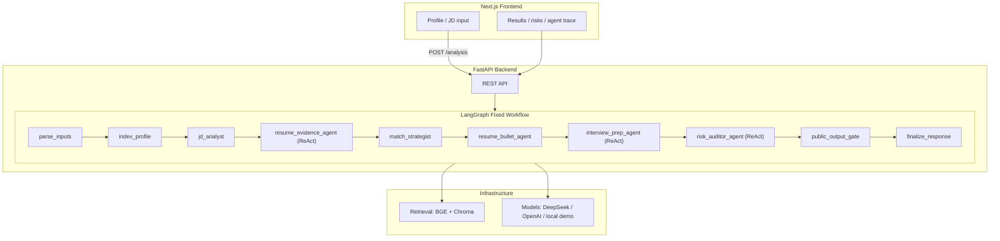

# CareerPilot Agent

**Language:** [English](README.md) | [简体中文](README.zh-CN.md)

CareerPilot Agent is a local AI assistant for job seekers. Give it your resume or career notes plus a target job description, and it helps you understand how well you match the role, which resume bullets to emphasize, what interview questions to prepare for, and where your application may look weak.

This project currently runs as a local web app. It is useful both as a job-search assistant demo and as an engineering portfolio project for evidence-grounded LLM workflows.

## What You Can Do With It

- Paste resume, project, internship, skill, and education materials.
- Upload a text-based PDF and extract its content.
- Paste a target job description.
- Generate a role match summary and requirement-by-requirement analysis.
- Get three resume bullets grounded in your own experience.
- Prepare for JD-focused questions and resume deep-dive questions.
- Review risk warnings, such as missing hard skills, weak evidence, or vague impact.
- Use local demo mode, OpenAI, DeepSeek, or an OpenAI-compatible model endpoint.

## What You Need

- A computer with [Docker Desktop](https://www.docker.com/products/docker-desktop/) installed.
- Your career materials in text form, Markdown, or a text-based PDF.
- A target job description.
- Optional: a DeepSeek or OpenAI API key if you want live model output.

No API key is required for local demo mode, but demo mode is deterministic and may produce similar-looking outputs for different inputs.

## Quick Start

Clone the repository:

```bash
git clone https://github.com/baihanshan/Career-Agent.git
cd Career-Agent
```

### Docker Launch (Recommended)

The fastest way to run the whole stack on any machine (macOS / Windows / Linux) is Docker. It starts the backend and frontend in **fake retrieval + local demo mode** by default — no BGE model download and no API key required.

Prerequisite: install [Docker Desktop](https://www.docker.com/products/docker-desktop/).

```bash
docker compose up --build
```

Then open:

```text
http://localhost:3000
```

The first build downloads base images and dependencies, which may take a few minutes.

To stop:

```bash
docker compose down
```

Notes:

- Docker intentionally runs `RETRIEVAL_BACKEND=fake` (token-count embeddings + in-memory store) so it starts instantly without downloading the BGE model.
- No API key is required — the app falls back to the built-in local demo mode. For live output, select **DeepSeek** (use model `deepseek-v4-pro`) or OpenAI and paste your API key in the model settings.
- A full analysis runs three ReAct agents sequentially and typically takes **10–15 minutes** with a reasoning model. This is expected for a multi-agent workflow, not a hang.

## How To Use The App

1. Add your personal materials.
   Paste resume text, project notes, internship descriptions, or upload a text-based PDF.

2. Add the target job description.
   Use the real JD you are preparing for. Longer, more specific JDs usually produce better analysis.

3. Choose a model service.
   Use local demo mode for a stable offline walkthrough, or enter your own OpenAI, DeepSeek, or compatible API key for live output.

4. Run the analysis.
   The app will parse your materials, extract JD requirements, retrieve supporting evidence, generate resume and interview suggestions, and check risks.

5. Review the results.
   Use the match analysis to decide whether to apply, use the resume bullets as draft material, and use the interview section to prepare concrete answers.

## How To Read The Results

- **Match summary:** a quick overview of fit and gaps.
- **Requirement analysis:** which JD requirements are strong, partial, weak, or missing.
- **Resume bullets:** evidence-grounded bullet drafts you can adapt into a resume.
- **Interview preparation:** questions and sample answer directions for both JD skills and your own experience.
- **Risk warnings:** gaps or weak evidence that may hurt screening or interviews.
- **Processing warnings:** recoverable issues from the workflow. If the main result is present, these warnings usually mean one part was degraded rather than the whole run failing.

## Privacy Notes

- The app is designed for local development and demo use.
- API keys entered in the UI are sent with the analysis request but are not written into project files.
- Do not commit real API keys, resumes, or private job materials to the repository.
- If you use a live model provider, your submitted content is sent to that provider according to its own terms.

## Troubleshooting

- **The app doesn't start:** make sure Docker Desktop is running, then rerun `docker compose up --build`.
- **The frontend cannot analyze:** check the browser Network tab for the `/analysis` response.
- **PDF upload fails:** use a text-based, unencrypted PDF under 10 MB, or paste the text manually.
- **Model list fails:** check provider, API key, and Base URL.
- **Live model output fails:** try local demo mode first to confirm the app itself is running, then switch to `deepseek-v4-pro`.

## Architecture

CareerPilot Agent is built as an evidence-grounded LLM application with a fixed workflow and local ReAct agents for high-value reasoning steps.

### System Overview



The top-level LangGraph stays deterministic and fixed. Local semantic decisions are delegated only where they add value:

- `ResumeEvidenceAgent` uses tool-calling ReAct to select grounded evidence.
- `InterviewPrepAgent` uses lightweight ReAct to separate JD capability questions from resume deep-dive questions.
- `RiskAuditorAgent` uses role-aware ReAct auditing to prioritize real screening risks over generic soft-skill gaps.
- JD analysis and resume bullet writing remain structured one-shot LLM calls.

ReAct agents use the current LangChain entrypoint:

```python
from langchain.agents import create_agent
```

OpenAI can use Pydantic `response_format`. DeepSeek and OpenAI-compatible providers use JSON-mode prompting plus local fallback parsing because provider support for Pydantic structured output is not consistent.

### API Surface

- `GET /health` returns `{ "status": "ok" }`.
- `POST /analysis` runs the full analysis workflow.
- `POST /models/list` fetches model options for OpenAI, DeepSeek, or compatible providers and returns `{ models, warning }`.
- `POST /documents/parse-pdf` extracts text from text-based PDFs up to 10 MB.

`POST /analysis` returns an `AnalysisResponse` with status, public requirements, match analysis, generated assets, evaluation report, risk report, processing warnings, and agent traces. Internal IDs stay behind the public output boundary.

## Project Boundaries

CareerPilot Agent intentionally does not handle:

- Automatic job applications.
- Browser automation.
- Multi-user login.
- Payments.
- Social features.
- Complex resume layout or document formatting.

The focus is a high-signal, evidence-grounded AI workflow that demonstrates agent architecture, retrieval, structured outputs, quality gates, and a usable Chinese frontend.

## Portfolio Summary

Architecture notes and resume-ready project bullets are available in `docs/sprint2/resume-bullets.md`.

## License

This project is licensed under the [MIT License](LICENSE).
